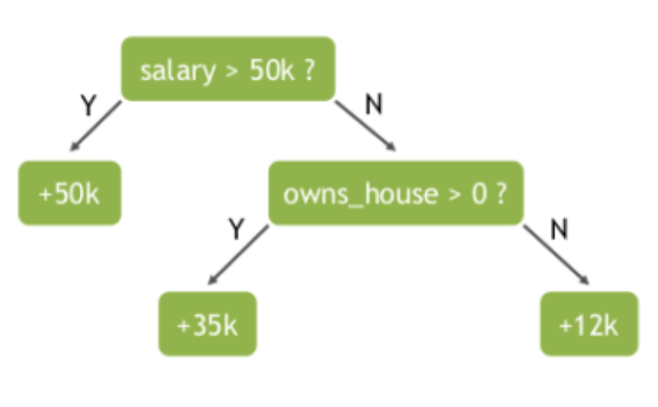
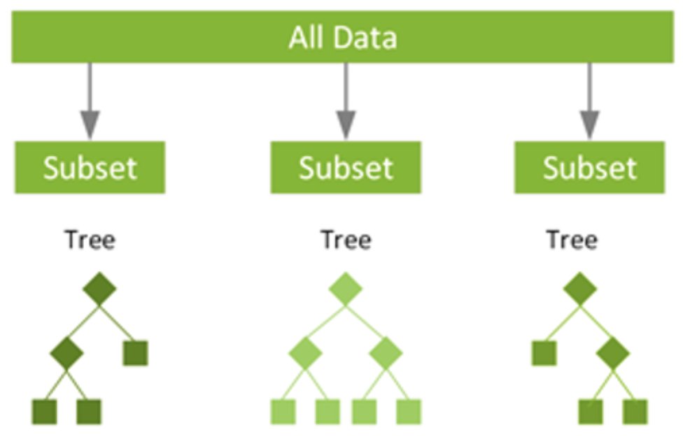
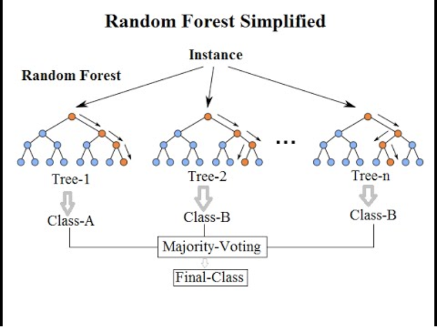

# Credit-Risk-Random-Tree

### Random Forest

Random forest is a popular ensemble learning method for classification and regression. 
Ensemble learning methods combine multiple machine learning (ML) algorithms to obtain a better model—the wisdom of crowds applied to data science. They’re based on the concept that a group of people with limited knowledge about a problem domain can collectively arrive at a better solution than a single person with greater knowledge.

**Random forest** is an ensemble of decision trees, a problem-solving metaphor that’s familiar to nearly everyone. Decision trees arrive at an answer by asking a series of true/false questions about elements in a data set. In the example below, to predict a person's income, a decision looks at variables (features) such as whether the person has a job (yes or no) and whether the person owns a house. In an algorithmic context, the machine continually searches for which feature allows the observations in a set to be split in such a way that the resulting groups are as different from each other as possible and the members of each distinct subgroup are as similar to each other as possible.




Random forest uses a technique called **“bagging”** to build full decision trees in parallel from random bootstrap samples of the data set and features. Whereas decision trees are based upon a fixed set of features, and often overfit, randomness is critical to the success of the forest. 



Randomness ensures that individual trees have low correlations with each other, which reduces the risk of bias. The presence of a large number of trees also reduces the problem of overfitting, which occurs when a model incorporates too much “noise” in the training data and makes poor decisions as a result.

With a random forest model, the chance of making correct predictions increases with the number of uncorrelated trees in our model. The results are of higher quality because they reflect decisions reached by the majority of trees. This voting process protects the individual trees from each other by limiting errors. Even though some trees are wrong, others will be right, so the group of trees collectively moves in the correct direction. While random forest models can run slowly when many features are considered, even small models working with a limited number of features can produce very good results.

Each tree in a random forest randomly samples subsets of the training data in a process known as bootstrap aggregating (bagging). The model is fit to these smaller data sets and the predictions are aggregated. Several instances of the same data can be used repeatedly through replacement sampling, and the result is that trees that are not only trained on different sets of data, but also different features used to make decisions.



**Advantages**

- It’s well-suited for both regression and classification problems.
- It handles missing values and maintains high accuracy, even when large amounts of data are missing thanks to bagging and replacement sampling.
- The algorithm makes model overfitting nearly impossible because of the “majority rules” output.
- The model can handle very large data sets with thousands of input variables, making it a good tool for dimensionality reduction.
- Its algorithms can be used to identify the most important features from the training data set.

**Disadvantages**

- Random forests outperform decision trees, but their accuracy is lower than gradient-boosted tree ensembles such as XGBoost.
- With a large number of trees, Random forests are slower than XGBoost

#### Additional Resources

- [StatQuest-Part1](https://www.youtube.com/watch?v=J4Wdy0Wc_xQ)
- [StatQuest-Part2](https://www.youtube.com/watch?v=sQ870aTKqiM&t=1s)
- [IBM](https://www.youtube.com/watch?v=gkXX4h3qYm4)

### Dataset

We will be exploring publicly available data from LendingClub. You can download the data from [here](https://www.lendingclub.com/info/download-data.action). Lending Club connects people who need money (borrowers) with people who have money (investors). Hopefully, as an investor you would want to invest in people who showed a profile of having a high probability of paying you back. Will try to create a model that will help predict this.

- **credit.policy:** 1 if the customer meets the credit underwriting criteria of LendingClub.com, and 0 otherwise.
- **purpose:** The purpose of the loan (takes values "credit_card", "debt_consolidation", "educational", "major_purchase", "small_business", and "all_other").
- **int.rate:** The interest rate of the loan, as a proportion (a rate of 11% would be stored as 0.11). Borrowers judged by LendingClub.com to be more risky are assigned higher interest rates.
- **installment:*** The monthly installments owed by the borrower if the loan is funded.
- **log.annual.inc:** The natural log of the self-reported annual income of the borrower.
- **dti:** The debt-to-income ratio of the borrower (amount of debt divided by annual income).
- **fico:** The FICO credit score of the borrower.
- **days.with.cr.line:** The number of days the borrower has had a credit line.
- **revol.bal:** The borrower's revolving balance (amount unpaid at the end of the credit card billing cycle).
- **revol.util:** The borrower's revolving line utilization rate (the amount of the credit line used relative to total credit available).
- **inq.last.6mths:** The borrower's number of inquiries by creditors in the last 6 months.
- **delinq.2yrs:** The number of times the borrower had been 30+ days past due on a payment in the past 2 years.
- **pub.rec:** The borrower's number of derogatory public records (bankruptcy filings, tax liens, or judgments).
- **not.fully.paid:** 1 if the loan is not paid in full, and 0 otherwise.

### Environment


```BASH
pyenv local 3.11.3
python -m venv .venv
source .venv/bin/activate
pip install --upgrade pip
pip install -r requirements.txt
```
If you are working on Windows type the following commands in the PowerShell:

```sh
python -m venv .venv
.venv\Scripts\Activate.ps1
```

*Note: If there are errors during environment setup, try removing the versions from the failing packages in the requirements file.*